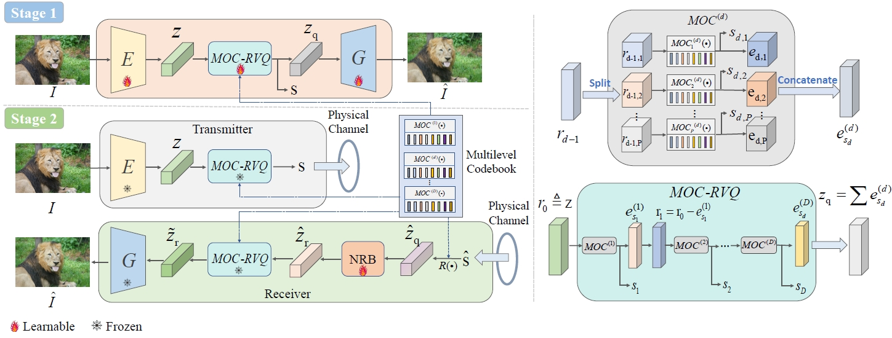

# MOC-RVQ

This repository contains the official PyTorch implementation for the paper  
**[MOC-RVQ: Multilevel Codebook-Assisted Digital Generative Semantic Communication (GLOBECOM 24)](https://arxiv.org/abs/2401.01272)**.



## Repository Updates
The codebase and pre-trained model weights will be released soon. Stay tuned!

## Citation
If you find our work useful in your research, please consider citing our paper:

```bibtex
@article{zhou2024moc,
  title={MOC-RVQ: Multilevel Codebook-assisted Digital Generative Semantic Communication},
  author={Zhou, Yingbin and Sun, Yaping and Chen, Guanying and Xu, Xiaodong and Chen, Hao and Huang, Binhong and Cui, Shuguang and Zhang, Ping},
  journal={arXiv preprint arXiv:2401.01272},
  year={2024}
}

